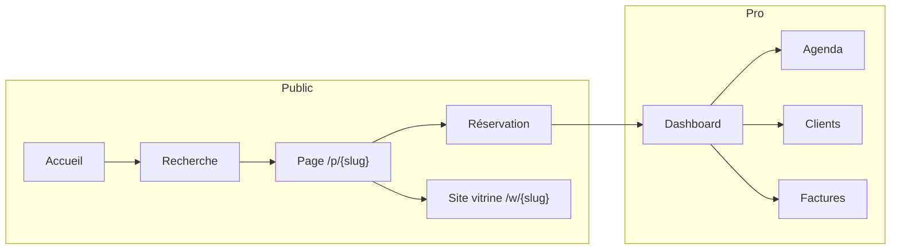

<p align="center">
  
</p>

<h1 align="center">Allo Tata</h1>

<p align="center">
  <strong>Concentrez-vous sur l’essentiel.<br>Allo Tata simplifie le quotidien des micro-entreprises.</strong>
</p>

<p align="center">
  Plateforme tout-en-un : agenda, clientèle, facturation, site vitrine, messagerie et finances.<br>
  Pensée pour les artisans, indépendants et petites équipes en France.
</p>

<p align="center">
  <a href="https://allotata.fr"></a>
  
  
  
  
  
</p>

<p align="center">
  <a href="https://allotata.fr">Site public</a> ·
  <a href="#démarrer-en-local">Installation</a> ·
  <a href="#documentation">Documentation</a> ·
  <a href="#déploiement">Déploiement</a>
</p>

---

## Qu’est-ce qu’Allo Tata ?

Allo Tata est à la fois **un outil de gestion** pour le professionnel et **une vitrine de réservation** pour ses clients.

Un coiffeur, un coach, un artisan ou une nounou crée son entreprise sur la plateforme. Ses clients le trouvent (recherche par nom, ville, service), consultent l’agenda, réservent un créneau, échangent en messagerie et laissent un avis. De son côté, le gérant pilote tout depuis un dashboard : planning, équipe, factures, stock, fidélité, site web.

Le produit est édité par **BrightShell** et en production sur [allotata.fr](https://allotata.fr).

### Deux publics, un même compte

| Rôle | Ce qu’il fait |
|------|----------------|
| **Client** | Cherche un pro, réserve, paie / suit ses RDV, discute, note la prestation. |
| **Gérant** | Crée une (ou plusieurs) entreprises, configure services et horaires, accepte les RDV, facture, suit sa compta. |

Le passage « client → gérant » se fait en créant sa première entreprise. Un essai gratuit permet de tester le Premium avant de s’abonner.



---

## Fonctionnalités

### Cœur métier

- **Agenda & réservations** — horaires d’ouverture, créneaux en temps réel, RDV en ligne ou manuels, statuts (attente / confirmée / terminée / annulée), rappels email (et SMS si configuré) 24 h et 2 h avant.
- **Page publique** — chaque entreprise a une URL `/p/{slug}` : services, tarifs, avis, calendrier, bouton réserver.
- **Messagerie** — conversation par client, images, propositions de créneaux, négociation de prix, commandes produits.
- **Facturation & finances** — factures PDF, recettes / dépenses, rapports (dont export utile pour l’URSSAF), historique des paiements.
- **Clientèle** — fiches, notes privées, historique, programme de fidélité (points et niveaux).
- **Avis vérifiés** — notation 5 étoiles après une vraie réservation, affichage public, modération.

### Options

| Option | Rôle |
|--------|------|
| **Site vitrine** | Éditeur visuel (blocs hero, services, galerie, FAQ…), thème, SEO, URL `/w/{slug}`, versions. |
| **Multi-personnes** | Équipe, agendas individuels, invitations, assignation des RDV, stats par membre. |

### Autour du métier

- Catalogue **produits / stocks** et promotions
- **Dashboard** client et entreprise (PWA installable)
- **Cours** intégrés pour apprendre à utiliser la plateforme
- Forum, FAQ, tickets support, feedback
- **2FA** (email / SMS / TOTP), appareils de confiance, logs de sécurité
- Sync **Google Calendar**, feed **Reserve with Google**
- Notifications push (Web Push / VAPID)
- Demandes **RGPD** (export / suppression)

Les paiements d’abonnements passent par **Stripe** (Checkout, webhooks, portail client, réconciliation automatique des échéances).

---

## Stack technique

| Couche | Choix |
|--------|--------|
| Backend | PHP 8.2+, [Laravel 12](https://laravel.com) |
| Frontend | Blade, [Tailwind CSS v4](https://tailwindcss.com), Vite 7 |
| Temps réel | Pusher (notes collaboratives, présence) |
| Paiements | Stripe + Laravel Cashier |
| PDF | DomPDF |
| Auth renforcée | Google2FA (TOTP) |
| Push | Web Push (VAPID) |
| Emails / SMS | SMTP + templates ; SMS optionnel |
| Prod | Docker (PHP-FPM, Nginx, MySQL 8), Supervisor, cron Laravel |

En local, SQLite suffit (voir `.env.example`). En production : MySQL 8.

---

## Arborescence

```
allotata/
├── app/
│   ├── Console/Commands/     # CRON : rappels, Stripe, backups, Google…
│   ├── Http/Controllers/     # Web, admin, API, BrightShell
│   ├── Models/               # Entreprise, Reservation, Facture, …
│   ├── Services/             # Logique métier (paiements, slots, RGPD…)
│   └── Mail/                 # Emails transactionnels
├── database/migrations/
├── resources/
│   ├── views/                # Blade (public, dashboard, admin, emails)
│   ├── css/  js/
│   └── lang/                 # FR
├── routes/
│   ├── web.php               # App principale
│   ├── api.php
│   └── console.php           # Planificateur
├── dev-docs/                 # Docs internes, exposées sur /dev
├── deploy/production/        # Nginx, Supervisor, script de deploy
├── docs/assets/              # Logo et assets README
└── public/
```

Pages utiles une fois l’app lancée :

| URL | Rôle |
|-----|------|
| `/` | Accueil + recherche |
| `/p/{slug}` | Page publique d’une entreprise |
| `/w/{slug}` | Site vitrine |
| `/dashboard` | Espace connecté |
| `/admin` | Back-office (admins) |
| `/dev` | Documentation développeur |
| `/brightshell` | ERP interne BrightShell (admins) |

---

## Démarrer en local

Prérequis : **PHP 8.2+**, **Composer**, **Node.js 20+**, **npm**.

```bash
git clone <url-du-repo> allotata
cd allotata

composer run setup
```

`setup` installe les dépendances PHP et JS, copie `.env`, génère `APP_KEY`, lance les migrations et compile les assets.

Puis, en un seul processus (serveur + queue + logs + Vite) :

```bash
composer run dev
```

L’app écoute en général sur [http://localhost:8000](http://localhost:8000).

### Configuration minimale

1. Copier `.env.example` → `.env` si ce n’est pas déjà fait.
2. Renseigner au moins :

```env
APP_NAME="Allo Tata"
APP_URL=http://localhost:8000
APP_LOCALE=fr
APP_TIMEZONE=Europe/Paris

DB_CONNECTION=sqlite          # ou mysql en collant DB_HOST / DB_DATABASE / …

MAIL_MAILER=log               # les mails s’écrivent dans storage/logs
```

3. Pour Stripe, Google Calendar, Push, IMAP BrightShell : voir `.env.example` et `config/services.php`. Sans ces clés, les modules concernés restent inactifs.

### Docker

Le `docker-compose.yaml` de chaque machine est **local** (gitignoré). Un modèle production se trouve dans `docker-compose.yaml.prod_stable`.

En prod typique : `laravel_app` (PHP-FPM) + `laravel_db` (MySQL 8) + `laravel_nginx`, derrière un reverse-proxy.

---

## Commandes utiles

```bash
php artisan migrate                 # migrations
php artisan db:seed                 # seeders
php artisan test                    # tests
npm run dev                         # Vite (hot reload)
npm run build                       # assets production

php artisan schedule:run            # une passe du planificateur
php artisan queue:listen --tries=1  # workers
php artisan db:backup --keep=30     # sauvegarde BDD
php artisan emergency:url           # URL de secours admin (token .env)
```

Tâches métier fréquentes : `reservations:send-reminders`, `subscriptions:check-echeances`, `subscriptions:process-payments`, `subscriptions:reconcile-echeances`, `essais:check-expiration`, `google-calendar:sync-all`.

---

## Planificateur

Laravel Scheduler (`routes/console.php`) suppose un cron :

```
* * * * * cd /chemin/vers/allotata && php artisan schedule:run >> /dev/null 2>&1
```

| Quand | Commande | Rôle |
|-------|----------|------|
| 02:00 | `db:backup` | Sauvegarde BDD (30 derniers) |
| 04:00 | `google:generate-merchant-feed` | Feed Reserve with Google |
| 05:00 | `google-calendar:renew-watches` | Renouvellement webhooks Google |
| 06:00–06:30 | abonnements Stripe | Échéances, factures, auto-charge, réconciliation |
| 07:00 | `gdpr:process-requests` | Demandes RGPD |
| 09:00 | `essais:check-expiration` | Essais gratuits |
| toutes les heures | rappels RDV 24 h / 2 h | Email (+ SMS) |
| toutes les 15 min | `google-calendar:sync-all` | Sync calendrier |
| lundi 09:00 | `reports:send-weekly` | Rapport gérants |
| 1er du mois 09:00 | `reports:send-monthly` | Rapport mensuel |

Détails : [dev-docs/deploy](dev-docs/deploy/).

---

## Documentation

La doc interne vit dans `dev-docs/` et s’affiche dans l’app sur **`/dev`** (compte connecté ; certains fichiers sont réservés admin).

| Dossier | Contenu |
|---------|---------|
| [dev-docs/stripe](dev-docs/stripe/) | Checkout, webhooks, portail, robustesse paiements |
| [dev-docs/deploy](dev-docs/deploy/) | Production, cron |
| [dev-docs/database](dev-docs/database/) | Backups, migrations |
| [dev-docs/email](dev-docs/email/) | Templates, SMTP, SMS |
| [dev-docs/api](dev-docs/api/) | Endpoints publics, pages `/p` et `/w` |
| [dev-docs/pusher](dev-docs/pusher/) | Temps réel |
| [dev-docs/integration](dev-docs/integration/) | Médiathèque, Kanban |
| [dev-docs/operations](dev-docs/operations/) | Perf, ops |
| [deploy/production](deploy/production/) | Nginx, Supervisor, `deploy.sh` |
| [docs/courses-manage.md](docs/courses-manage.md) | CLI des cours |

Webhook Stripe à déclarer : `POST /stripe/webhook` (signature Stripe, pas de CSRF).

---

## Déploiement

Guide pas à pas : [deploy/production/README.md](deploy/production/README.md) et [dev-docs/deploy/PRODUCTION_README.md](dev-docs/deploy/PRODUCTION_README.md).

En résumé :

1. `APP_ENV=production`, `APP_DEBUG=false`, `APP_URL=https://allotata.fr`
2. `composer install --no-dev --optimize-autoloader` puis `npm run build`
3. Nginx → `public/`, PHP-FPM, permissions `storage/` et `bootstrap/cache`
4. Supervisor pour la queue
5. Cron `schedule:run` chaque minute
6. Clés Stripe / webhook, mail, VAPID, `EMERGENCY_RECOVERY_TOKEN`

Le script `deploy/production/deploy.sh` enchaîne pull, dépendances, migrations et build.

---

## BrightShell

`/brightshell` n’est **pas** le produit public. C’est l’ERP interne de l’éditeur (agenda, devis, factures, stock, mailing IMAP, Kanban, documents), réservé aux administrateurs, dans la même application Laravel.

Allo Tata = SaaS + marketplace pour les micro-entreprises. BrightShell = outil interne de l’équipe.

---

## Licence

Application propriétaire, éditée par **BrightShell**. Le framework Laravel reste sous licence MIT.

Contact : [allotata.fr](https://allotata.fr) · [brightshell.fr](https://brightshell.fr)
